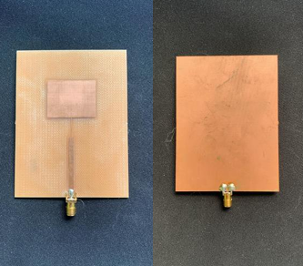

# une-Antenne-Patch-3-GHz
Conception d’une Antenne Patch Rectangulaire à 3 GHz
Ce dépôt contient :
- Le rapport de travail complet décrivant les étapes de conception et les résultats obtenus.
- Les fichiers de conception de l'antenne (réalisés avec EAGLE).

Deux outils principaux ont été utilisés pour concevoir cette antenne :
- EAGLE : Utilisé pour réaliser le layout de l’antenne, notamment le dessin du patch et de la ligne d’alimentation.
- StripCalc: Utilisé pour déterminer avec précision la largeur de la ligne de transmission micro-ruban.
- Les calculs tiennent compte de :
  - L’impédance souhaitée
  - La fréquence de fonctionnement
  - Les caractéristiques du substrat
 
Quelques spécifications de l’antenne :
- Type : Antenne patch rectangulaire
- Méthode d’alimentation : Micro-ruban
- Fréquence de fonctionnement : 3 Ghz
- Impédance : 50 ohms

Voici une image de l’antenne réellement fabriquée lors de ce projet :

Pour analyser le rayonnement de l'antenne, deux méthodes ont été utilisées :
- Gyroscanfield : Permet une visualisation en 2D et 3D du diagramme de rayonnement, bien que limitée par la fréquence de résonance à 3 GHz.
- Banc de Mesure Spécifique :
  - Antenne biconique Schwarzbeck RS0460
  - Analyseur de spectre Rohde & Schwarz FPH
  - Générateur de signaux Rohde & Schwarz
  - Alimentation stabilisée

Ces équipements ont permis de mesurer avec précision le rayonnement de l'antenne et de générer un diagramme de rayonnement.

Pour plus d’informations, vous pouvez me contacter via :
- LinkedIn : Yasmin Kaaouiche

